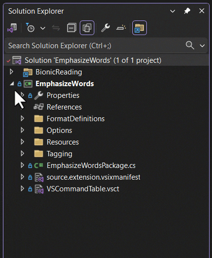
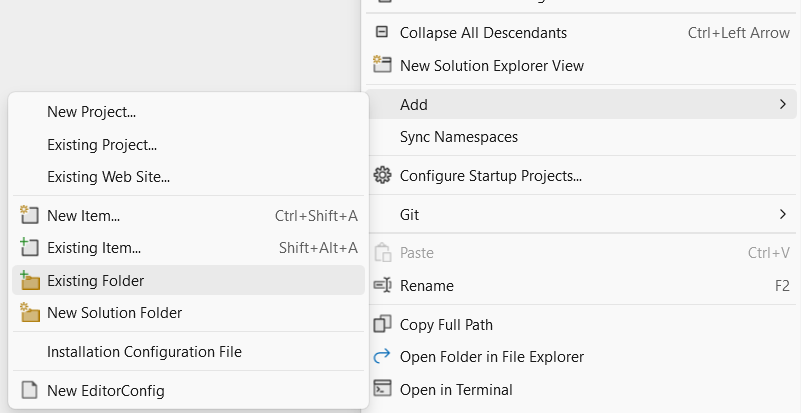

[marketplace]: https://marketplace.visualstudio.com/items?itemName=MadsKristensen.WorkflowBrowser
[vsixgallery]: http://vsixgallery.com/extension/WorkspaceFiles.e5308ac4-ca47-4992-945b-9b144a10c2d0/
[repo]:https://github.com/madskristensen/WorkspaceFiles

# File Explorer for Visual Studio

Download this extension from the [Visual Studio Marketplace][marketplace]
or get the [CI build][vsixgallery].

----------------------------------------

> Inspired by [a popular Visual Studio feature request](https://developercommunity.visualstudio.com/t/Make-Solution-Folders-map-to-real-folder/358125?ftype=idea&stateGroup=active) on Developer Community.

Gives access to all files and folders from the file system under the repo- or solution root folder. All in the same Solution Explorer view.

 

Add any folder you want by right-clicking the solution node and select **Add > Existing Folder**.

Files and folders matching a pattern in the `.gitignore` file are automatically grayed out in the Solution Explorer.

## How can I help?
If you enjoy using the extension, please give it a ★★★★★ rating on the [Visual Studio Marketplace][marketplace].

Should you encounter bugs or if you have feature requests, head on over to the [GitHub repo][repo] to open an issue if one doesn't already exist.

Pull requests are also very welcome, since I can't always get around to fixing all bugs myself. This is a personal passion project, so my time is limited.

Another way to help out is to [sponsor me on GitHub](https://github.com/sponsors/madskristensen).