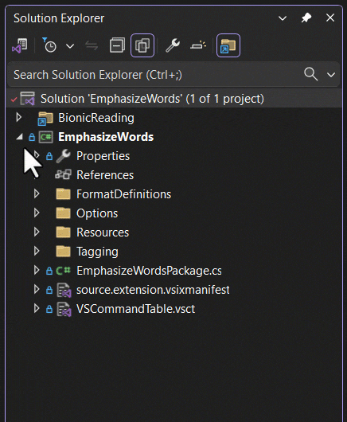
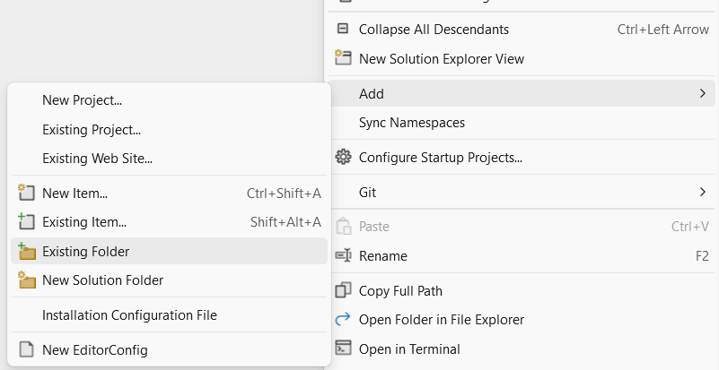

[marketplace]: <https://marketplace.visualstudio.com/items?itemName=MadsKristensen.WorkflowBrowser>
[vsixgallery]: <http://vsixgallery.com/extension/WorkspaceFiles.e5308ac4-ca47-4992-945b-9b144a10c2d0/>
[repo]: <https://github.com/madskristensen/WorkspaceFiles>

# File Explorer for Visual Studio

Download this extension from the [Visual Studio Marketplace][marketplace]
or get the [CI build][vsixgallery].

--------------------------------------

**Access all your files without leaving Solution Explorer.** File Explorer brings the full file system into Visual Studio, so you never have to switch to Windows Explorer again.

## ✨ Key Features at a Glance

- **Physical Folder Support** — Add real file system folders directly to Solution Explorer
- **Search Support** — Use Solution Explorer's search to find files across physical folders
- **.gitignore Aware** — Ignored files are automatically grayed out for easy identification
- **Image Previews** — Hover over image files to see a thumbnail preview
- **Open With...** — Open any file with a specific Visual Studio editor
- **Customizable Filters** — Control which files and folders are visible
- **Seamless Integration** — Works naturally within the familiar Solution Explorer

## Why File Explorer?

> Inspired by [a popular Visual Studio feature request](https://developercommunity.visualstudio.com/t/Make-Solution-Folders-map-to-real-folder/358125?ftype=idea&stateGroup=active) on Developer Community.

Working with files outside your project can be frustrating in Visual Studio:

- **Constant context switching** — Jumping between Visual Studio and Windows Explorer
- **Hidden files** — Config files, scripts, and assets that aren't in your project are invisible
- **No quick access** — README files, documentation, and other repo files require extra steps to open

File Explorer solves these problems by giving you access to all files and folders from the file system under the repo or solution root folder—all within the Solution Explorer view.

## Features

### Add Physical Folders

Right-click the solution node and select **Add > Existing Folder** to add any folder from your file system.

### .gitignore Support

Files and folders matching a pattern in the `.gitignore` file are automatically grayed out in Solution Explorer, making it easy to distinguish tracked from ignored files.

### Image Hover Preview

Hovering over image files shows a preview tooltip of the image—no need to open files just to see what they contain.

### Open With...

Right-click any file and select **Open With...** to choose from the available Visual Studio editors.

This is useful when you want to open the same file in a different editor (for example, source view, designer view, or XML editor) without leaving Solution Explorer.

### Customizable Filters

Control which files and folders are displayed by going to **Tools > Options > File Explorer** and configuring the filters to match your workflow.

## How can I help?

If you enjoy using the extension, please give it a ★★★★★ rating on the [Visual Studio Marketplace][marketplace]. It only takes a few seconds but makes a huge difference!

Found a bug or have a feature idea? Head over to the [GitHub repo][repo] to open an issue if one doesn't already exist.

Pull requests are enthusiastically welcomed! As this is a personal passion project maintained in my spare time, I can't always address every issue promptly. Your contributions help keep this extension vibrant and reliable for everyone.

If you find this extension saves you time or improves your workflow, please consider [sponsoring me on GitHub](https://github.com/sponsors/madskristensen). Even a small donation helps ensure continued development and support. Your sponsorship directly enables me to dedicate more time to this and other free extensions for the community. Thank you for your support!
